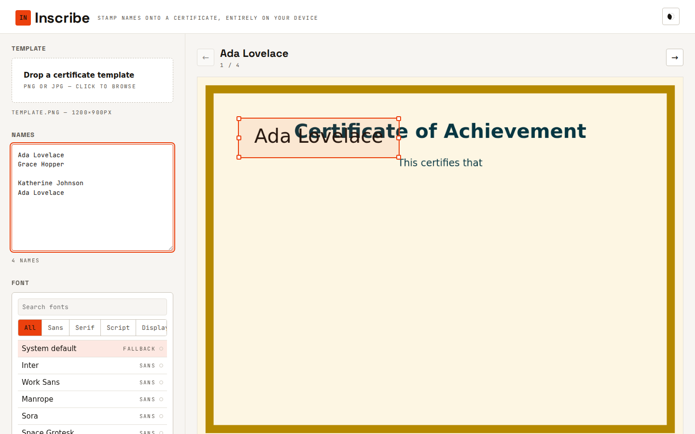
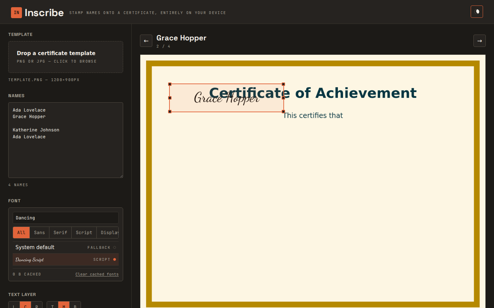

# Inscribe

Stamp a list of names onto a certificate template and export the results as a PDF or a ZIP of PNGs — entirely in your browser. No backend, no accounts, no upload: the template image and the name list never leave your device.

| Light | Dark |
| --- | --- |
|  |  |

## What it does

1. Drop in a certificate template (PNG or JPG). Its native resolution becomes the working canvas.
2. Paste a list of names, one per line.
3. Position and size a text layer on top of the template by dragging, resizing, and aligning it.
4. Pick a font from a curated catalog — fonts are only downloaded when you select them, then cached locally so reloads are instant.
5. Step through the name list in the live preview to check that the longest name still fits.
6. Export every certificate as a single PDF, or as a ZIP of individually named PNGs.

## Local development

Requires Node.js 20+.

```bash
npm install
npm run dev
```

This starts a Vite dev server at `http://localhost:5173/inscribe/` (the `/inscribe/` prefix matches the production base path).

Other scripts:

```bash
npm run typecheck   # tsc --noEmit
npm run build        # type-check, then production build to dist/
npm run preview      # serve the production build locally
```

## How it's built

- Vite + vanilla TypeScript. No framework, no UI kit, no CSS framework — hand-written CSS using custom properties for theming.
- A single render path (`src/render/renderCertificate.ts`) draws the template and text to an offscreen canvas; the live preview, the ZIP export, and the PDF export all call it, so what you see in the preview is exactly what gets exported. The render path never reads the current UI theme, so exports are unaffected by dark mode.
- Fonts are sourced from the [Fontsource](https://fontsource.org/) CDN on jsDelivr as `woff2`/`woff` file bytes, fetched on demand and cached in IndexedDB, then registered with `document.fonts` via the `FontFace` API. PDF export draws the already-rasterized canvas image rather than jsPDF's own text API, so there's no silent fallback to Helvetica from an unembeddable webfont.
- Undo/redo for the text layer is a small snapshot stack bound to Cmd/Ctrl+Z and Cmd/Ctrl+Shift+Z.
- Exports run in batches, yielding to the event loop between items, with a progress bar and a cancel button so a few hundred names don't freeze the tab.

## Deployment

The included GitHub Actions workflow (`.github/workflows/deploy.yml`) builds the app and deploys `dist/` to GitHub Pages on every push to `main`. In your repository settings, set **Pages → Source** to **GitHub Actions**.

The Vite `base` is set to `/inscribe/` in `vite.config.ts` to match `https://arlian.github.io/inscribe/`. If you fork this under a different repository name, update `base` accordingly.

## Browser support notes

- Font caching requires IndexedDB. In browsers or private-browsing modes where it's unavailable, fonts still work for the current session — they're just re-downloaded on the next visit, and the font picker says so.
- ZIP and PDF exports save via the File System Access API where available, and fall back to a normal browser download everywhere else.
